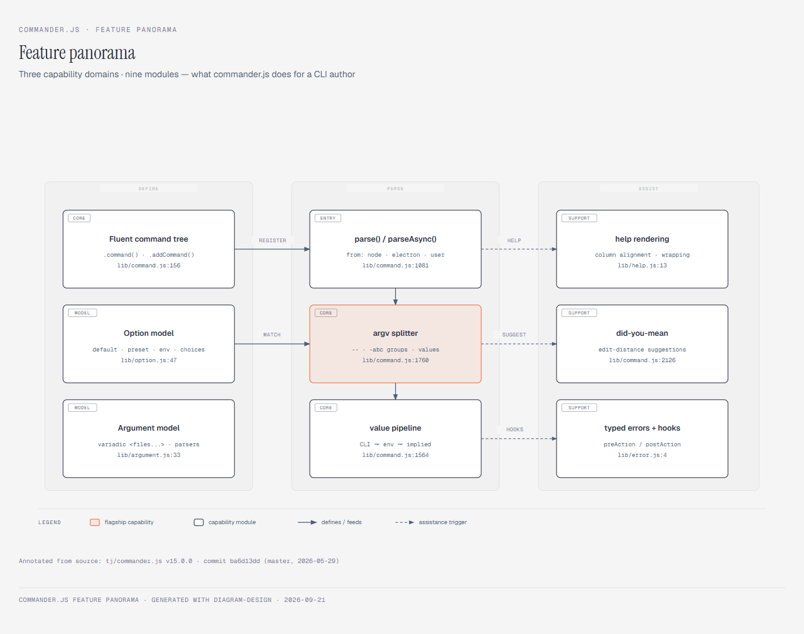

# explain-hub

**Turn your GitHub stars — or the agent skills installed on your machine — into tiered, diagram-backed explainers.**

[](LICENSE)
[](https://github.com/baichuanjiang2-cell/explain-hub/actions/workflows/ci.yml)

English | [简体中文](README.zh-CN.md)

```text
Your GitHub stars, tiered automatically
├── key repos → deep dives: README (three angles + file:line anchors)
│               + panorama, architecture and runtime-flow diagrams
└── the long tail → one-page notes

Your installed agent skills, inventoried
├── standalone → six-section explainer (positioning / when / trigger / example / pairings / caveats)
├── families   → merged into one overview (member roles + cooperation chain)
└── broken     → root cause + reinstall guide
```

explain-hub is a reusable [agent skill](https://github.com/topics/agent-skills)
distilled from real batch-explainer runs, with every diagram passing an
independent visual review. Drop it into Claude Code, Codex, ZCode or any
Agent-Skills-compatible host, then just talk to your agent.

## Example output

A real run on [`tj/commander.js`](https://github.com/tj/commander.js) — the
full deep dive lives in [`examples/tj__commander.js/`](examples/tj__commander.js/)
(README with `file:line` anchors + three diagram HTML files + rendered PNGs):

<p align="center">
  
</p>
<p align="center"><em>Functional panorama (one of the three diagrams every A-tier explainer ships).</em></p>

## What it does

| Mode                     | Input                       | Output                                                                                                                                        |
| ------------------------ | --------------------------- | --------------------------------------------------------------------------------------------------------------------------------------------- |
| **A · Stars explainer**  | a GitHub username           | `stars-explained/`: one folder per A-tier repo (deep README + 3 interactive SVG diagram HTML files + PNG previews), one-pagers for the B-tier |
| **B · Skills inventory** | this machine (auto-scanned) | `skills-explained/`: family-merged skill explainers + a master index + a broken-skills report                                                 |

The engine's hard rules — all earned the hard way during real runs:

- **Mandatory diagrams + visual acceptance.** The three diagrams must pass
  connector rules (orthogonal elbows, masked labels with gaps, dashed-line
  crossing bridges) and a complexity budget (≤9 nodes / ≤3 zones / ≤2 accent
  elements), get screenshot-rendered for self-check, then go through an
  independent visual review agent when a sub-agent runtime is available.
- **Tiered treatment.** A-tier gets the full deep dive; B-tier gets a
  one-pager as the floor. Tiering heuristics are tunable.
- **Fact discipline.** Every claim carries a `file:line` anchor; facade repos
  (high stars, empty scaffold on `main`) are detected and routed to the real
  code; doc-vs-code drift is checked and reported; unverifiable items are
  labeled as such.
- **Fallback chains for everything.** no `gh` → public API; clone fails →
  raw-file analysis; Chromium download fails → the msedge channel for
  screenshots; sub-agents rate-limited → re-dispatch after the rest finish.

## Install

Copy this directory into any skill-discovery path:

```bash
# user-level (available in every project)
cp -r explain-hub ~/.agents/skills/explain-hub

# or project-level (this repo only)
cp -r explain-hub .agents/skills/explain-hub
```

Requirements: an agent runtime (Claude Code / Codex / ZCode / …),
`npx playwright` and the system Edge browser (for diagram screenshot QA). The
diagram engine [diagram-design](third-party/diagram-design/VENDORED.md) is
bundled in this repo; the skill probes for / installs it automatically at
runtime.

## Usage

Just talk to your agent:

- “Explain my GitHub stars — username `octocat`”
- “What are all these repos in my stars? Pick the important ones and go deep”
- “Inventory the skills installed on this machine and explain what each does”
- “Walk me through how `vercel/next.js` runs”

The skill first presents the inventory and a tiering plan for you to confirm,
then produces in batches; everything lands in a new output directory. All
documents are written in the language you speak.

## Layout

```text
explain-hub/
├── SKILL.md                     # the main flow (progressive-disclosure entry)
├── references/
│   ├── playbook.md              # field rules: fallback chains / facade repos /
│   │                            #   drift checks / rate-limit re-dispatch / cadence
│   └── diagram-spec.md          # the three diagrams: briefs / SVG rules /
│                                #   render chain / acceptance rubric
├── assets/templates/
│   ├── readme-template.md       # three-angle deep-dive README template
│   └── *-template.html          # page chrome for the three diagrams
│                                #   (skin / legend / a11y ready)
└── third-party/diagram-design/  # the diagram engine, vendored (MIT)
```

## Field-tested

Every rule in `references/` was earned in real batch runs: API fallback
chains, facade-repo detection, rate-limit recovery, doc-vs-code drift checks,
and the visual-acceptance loop behind the three diagrams. A full worked
example ships under [`examples/`](examples/).

## Contributing

See [CONTRIBUTING.md](CONTRIBUTING.md). Changes to the rules are welcome —
bring the field evidence. | 参与贡献请阅读 [CONTRIBUTING.md](CONTRIBUTING.md)。

## License

MIT — see [LICENSE](LICENSE). Bundled third-party software:
[diagram-design](third-party/diagram-design/) by Cathryn Lavery, MIT, vendored
unmodified (see its [VENDORED.md](third-party/diagram-design/VENDORED.md) and
[license](third-party/diagram-design/LICENSE)).
